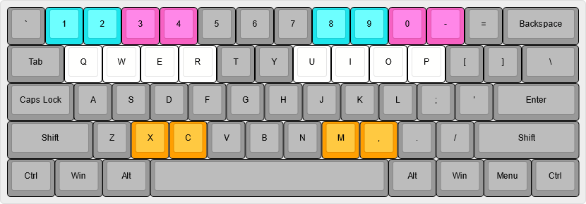

# Voltyx

Voltyx is a clone of the arcade rhythm game [SOUND VOLTEX][1].

## Key bindings

The default key bindings are:

BT buttons: `Q` `W` `O` `P`\
FX buttons: `X` `,`\
Blue laser: `1` `2` (left/right)\
Pink laser: `0` `-` (left/right)

Menus can be navigated with enter, escape, and the arrow keys.

For playing complex patterns, a secondary set of keys are assigned to allow
each hand to hit any input:

## Files

If the file `config.ini` exists and contains the line `appdata = false`,
data will be stored in the same folder as the program.

Otherwise, data is stored in a user-specific folder:

Windows: `%LOCALAPPDATA%\Voltyx`\
Unix: `~/.local/share/Voltyx`\
macOS: `~/Library/Application Support/Voltyx`

When Voltyx is first run, it will create a `songs` folder for you to copy
songs into (each should be in its own subfolder).

[1]: https://p.eagate.573.jp/game/sdvx/
